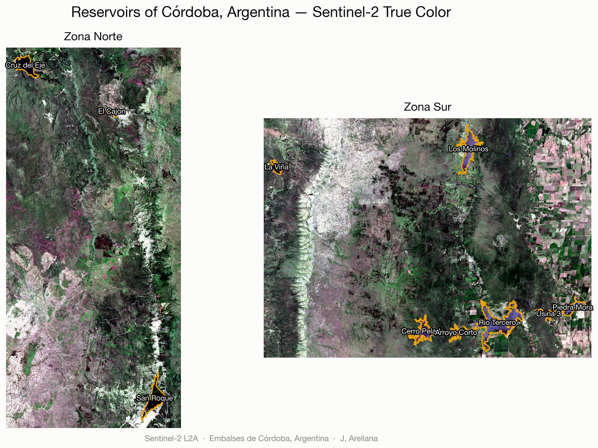

<p align="center">
  
</p>

# 🌊 water-reservoir-data-analysis


## 🛰️ Trophic State Analysis of the Reservoirs of Córdoba
**Based on Sentinel-2 optical satellite imagery.**

Repository dedicated to the analysis of the trophic state of several reservoirs in the province of Córdoba, Argentina, using **remote sensing, spatial analysis, and machine learning** tools.

This is the reorganized version of the repository: it contains only the code and vector data that the algorithm actually uses (loose folders and files with no references in the code were removed). See `DOCUMENTATION.txt` for a line-by-line breakdown of what each folder does, the pipeline logic, and the satellite data that is missing/was added.

---

## 🌐 Interactive Report

<p align="center">
  
</p>

**[`index.html`](index.html)** — "Bloom Watch", a self-contained, interactive one-page summary of the analysis: a drag-to-compare true-color / classified view of the Los Molinos reservoir, a live confusion matrix and feature-importance chart for the Random Forest model, and a sortable inventory of all 10 reservoirs by surface area. No build step or server needed — open the file directly in a browser, or serve the repo root with GitHub Pages.

Generated with `scripts/linkedin_figures.py`, which re-runs the same Sentinel-2 → Random Forest pipeline as `RandomForest.ipynb` and exports both the static figures in `assets/linkedin/` and the data embedded in `index.html`.

---

## 📂 Repository Contents

### 🗂️ Folders
- 🗺️ **Poligonos**
  All the project's vector information in one place:
  - `Embalses_unificado.shp` — the single polygon with the outline of all the reservoirs, used by all 4 notebooks to clip the satellite image to the area of interest before computing any index.
  - `Norte/PoligonosEmbalses18-10.shp` — individual reservoir polygons for the Northern zone (Cruz del Eje, El Cajón, San Roque), used to split statistics by reservoir.
  - `Sur/PoligonosEmbalsesSur18-10.shp` — same as above for the Southern zone (Río Tercero, Los Molinos, Piedra Mora, Cerro Pelado, Arroyo Corto, La Viña, Usina 3).
  - `Entrenamiento_2022/` — training polygons (hand-drawn ROIs) used by `Presentacion2.ipynb` and `RandomForest.ipynb` as labeled samples for the supervised classifiers and to compare spectral signatures between land covers.

- 🛰️ **ImagenesSentinel**
  Single folder with all the Sentinel-2 stacks used by the notebooks: `Norte_20mTODOS.tif` and `Sur_20mTODOS.tif` (2021-01-17, 11 bands at 20 m) and `stack2022norte.tif` and `StackRecortado_Molinos_B1a8_11_12.tif` (2022-02-18, 10 bands at 20 m). They were generated from public Sentinel-2 L2A data (see section 3 of `DOCUMENTATION.txt`) and are versioned with **Git LFS** due to their size.

- 🖼️ **assets/linkedin**
  Static PNG figures rendered from the same Random Forest pipeline as `RandomForest.ipynb`, used as the data source and preview images for `index.html`: a study-area map (`01_study_area.png`), the Los Molinos true-color vs. classification comparison (`02_classification.png`), and the confusion matrix / feature-importance panel (`03_model_diagnostics.png`).

---

### 📑 Main Files
- 📘 **Estadistica_ROIs.ipynb**
  Notebook that analyzes statistics of the **Regions of Interest (ROIs)**:
  - Spectral Signature
  - Optical Indices (NDVI, NDWI)
  - Brightness, Greeness, Wetness

- 🌲 **RandomForest.ipynb**
  Implementation of a **Random Forest** model (and decision tree) to classify trophic state, with confusion matrix, accuracy, kappa, and cross-validation.

- ⚙️ **funciones.py**
  Helper functions:
  - `nequalize()` - normalizes/equalizes bands by percentiles.
  - `plot_rgb()` - composes and plots band combinations.
  - `delNone()` - discards nodata and normalizes by the reflectance factor.
  - `guardar_GTiff()` - writes an array to GeoTIFF with CRS and transform.

- 📙 **Presentacion1.ipynb** and **Presentacion2.ipynb**
  - **KMeans** (and k-POD) classification methods applied to the ROIs.
  - **Machine Learning** methods applied to the ROIs together with spectral signature analysis:
    - Tasseled Cap (Brightness, Greeness, Wetness)
    - Supervised and Unsupervised Classifiers

- 📝 **DOCUMENTATION.txt**
  Detail of the pipeline logic, what each folder is used for, additional dependencies detected in the code, and what was excluded from the original repository and why.

- 🌐 **index.html**
  "Bloom Watch" — the interactive report described above. Self-contained (fonts aside), all data and images inlined; no server required.

- 📊 **scripts/linkedin_figures.py**
  Re-runs the Sentinel-2 → Random Forest pipeline (Los Molinos reservoir) end to end and exports the static figures in `assets/linkedin/` and the stats consumed by `index.html`. Run it inside the `embalses` conda environment from the repo root: `python scripts/linkedin_figures.py`.

---

## ▶️ Running the Project

1. **Clone the repository**
   ```bash
   git clone https://github.com/arellana/water-reservoir-data-analysis.git
   cd water-reservoir-data-analysis
   ```

2. **Set up the environment**
   Install dependencies from the **YAML** file:

   ```bash
   conda env create -f dependencies.yml
   ```

   Some dependencies detected in the code are missing from `dependencies.yml` (`kPOD`, `dictances`, `cmasher`); install them separately with pip. See `DOCUMENTATION.txt` (section 4).

3. **Explore the notebooks**

   * 📘 `Estadistica_ROIs.ipynb`: ROI statistics.
   * 📙 `Presentacion1.ipynb` and `Presentacion2.ipynb`: visual analysis and ML methods.
   * 🌲 `RandomForest.ipynb`: applied supervised model.

4. **Inspect the geospatial data**

   * The `Poligonos` folder (with its `Norte`, `Sur`, and `Entrenamiento_2022` subfolders) contains all the algorithm's input polygons.
   * 🔧 The **Regions of Interest (ROIs)** can be modified to study new sites.

5. **Open the interactive report**

   * 🌐 Open `index.html` directly in a browser to explore "Bloom Watch" (no server needed).
   * 📊 To regenerate it (or the static figures in `assets/linkedin/`) after changing the data or model, run `python scripts/linkedin_figures.py` from the repo root, inside the `embalses` environment.

---

## 📝 To Do

* 🗺️ Replace `Poligonos/Entrenamiento_2022/TrainingMolinosPoligonos.shp` with real hand-drawn ROIs for Los Molinos. The current file is a **synthetic placeholder** (spectral clustering + visual review, not recovered/expert-labeled data) generated so `RandomForest.ipynb` runs end to end — see `DOCUMENTATION.txt` section 3.1 for caveats before trusting its classifier results.
* 🛰️ Define and generate `ImagenesSentinel/stack2022norte-2.tif`, used by `Presentacion2.ipynb` (zona='norte-2') and not yet available.
* 📦 Add `kPOD`, `dictances`, and `cmasher` to `dependencies.yml`.
* 📖 Document each notebook with clear descriptions.

---

## 👨‍🔬 Credits

Developed by **Javier Arellana**

* Institute of Astronomy and Space Physics (IAFE), **UBA – CONICET**
* Department of Physics, School of Exact and Natural Sciences, **University of Buenos Aires**
* [LinkedIn](https://www.linkedin.com/in/javier-arellana/) · [GitHub](https://github.com/arellana)

---
